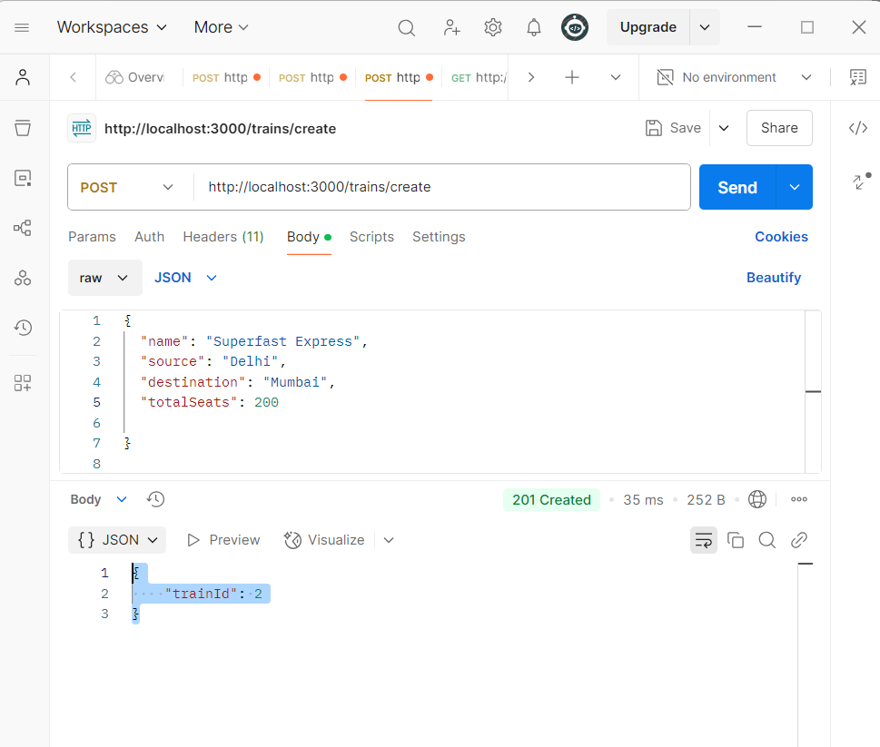

# IRCTC Railway Management API

## Table of Contents
- [Introduction](#introduction)
- [Features](#features)
- [Tech Stack](#tech-stack)
- [Installation](#installation)
- [Environment Variables](#environment-variables)
- [Running the Project](#running-the-project)
- [API Endpoints](#api-endpoints)
- [Security Measures](#security-measures)


---

## Introduction
This project is a simple Railway Management System API that allows users to search for trains between two stations, check seat availability, and book seats. It also includes admin functionalities for managing trains. The API is optimized for handling race conditions and concurrent bookings.

## Features
- User authentication (Register/Login)
- Admin role for managing trains
- Fetch trains based on source and destination
- Check seat availability
- Book seats with proper concurrency handling
- Secure API endpoints with JWT authentication & API key

## Tech Stack
- **Backend**: Node.js, Express.js
- **Database**: MySQL
- **Authentication**: JWT (JSON Web Token)

## Installation
To run the project locally, follow these steps:

### 1. Clone the repository
```sh
git clone [<repo-link>](https://github.com/singh2505/APP-IRCTC.git)
cd APP-IRCTC
```

### 2. Install dependencies
```sh
npm install
```

### 3. Set up the database
Ensure MySQL is running, then execute the following:
```sh
mysql -u root -p < schema.sql
```

## Environment Variables
Create a `.env` file in the project root and add the following:
```ini
HOST=127.0.0.1
USER=root
PASSWORD=your_mysql_password
DATABASE=irctc
JWT_SECRET=your_secret_key
ADMIN_KEY=your_admin_api_key
```

## Running the Project
Start the server:
```sh
npm start
```

The API will be accessible at `http://localhost:3000`.

## API Endpoints

### Authentication
| Method | Endpoint       | Description         |
|--------|--------------|--------------------|
| POST   | /register  | Register a user   |
| POST   | /login     | Login a user      |


### Admin Routes (Require API Key)
| Method | Endpoint     | Description           |
|--------|-------------|----------------------|
| POST   | /trains/create  | Add a new train      |



### User Routes (Require JWT Token)
| Method | Endpoint          | Description                 |
|--------|------------------|----------------------------|
| GET    | /trains         | Get trains between cities  |
| GET    | /seats/:trainId | Check seat availability    |
| POST   | /book           | Book a seat               |
| GET    | /booking/:id    | Get booking details       |


## Security Measures
- **JWT Authentication**: Protects user-related endpoints.
- **API Key Protection**: Admin routes require a valid API key.
- **Concurrency Handling**: Prevents multiple users from booking the same seat simultaneously.

## Assumptions
- Each train runs on a fixed route (source to destination).
- Seat availability is updated in real time.
- Only authenticated users can book seats.
- Admins are responsible for managing trains.

## License
This project is for educational purposes only.
